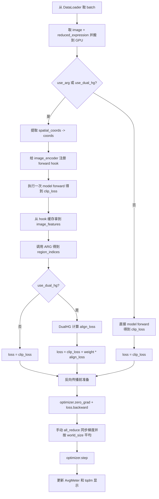

# BLEEP `main` 训练流程图（含模块详解）

本文档对应 `BLEEP_main.py` 的主训练入口，覆盖从 DDP 初始化到模型保存的完整流程，并补充每个关键模块的职责、输入输出和在训练中的位置。

## 1) 主流程图（`main()`）

```mermaid
flowchart TD
    A[启动脚本<br/>python -m torch.distributed.run ... BLEEP_main.py] --> B[解析命令行参数 argparse<br/>exp_name batch_size max_epochs model use_arg use_dual_hg 等]
    B --> C{参数合法性检查}
    C -->|use_dual_hg=True 且 use_arg=False| C1[抛出 ValueError 并终止]
    C -->|合法| D[读取 DDP 环境变量<br/>LOCAL_RANK RANK WORLD_SIZE]
    D --> E[绑定当前 GPU<br/>torch.cuda.set_device(local_rank)]
    E --> F[初始化进程组<br/>dist.init_process_group]
    F --> G[按 model 选择 CLIPModel 变体<br/>resnet50/resnet101/resnet152/vit/vit_l/clip]
    G --> H[用 DistributedDataParallel 包裹主模型]
    H --> I{是否启用 ARG?}
    I -->|是| I1[构建 AdaptiveRegionGenerator<br/>仅用于区域划分/索引]
    I -->|否| J
    I1 --> J{是否启用 DualHG?}
    J -->|是| J1[构建 DualHypergraphAligner<br/>参与反向传播]
    J -->|否| K
    J1 --> K[构建 DataLoader<br/>build_loaders]
    K --> L[构建优化器 AdamW<br/>可包含 model + dual_hg_aligner 参数]
    L --> M[构建学习率调度器<br/>ReduceLROnPlateau]
    M --> N[Epoch 循环]

    N --> O[train_loader.sampler.set_epoch]
    O --> P[train_epoch]
    P --> Q[test_epoch]
    Q --> R[lr_scheduler.step(test_loss.avg)]
    R --> S{test_loss 优于 best? 且 rank==0}
    S -->|是| T[保存 best.pt 到 exp_name 目录]
    S -->|否| U[继续下一轮]
    T --> U
    U --> V{到达 max_epochs?}
    V -->|否| N
    V -->|是| W[打印最优 loss/epoch]
    W --> X[cleanup 销毁进程组]
```

## 2) 训练/验证单轮内部流程图



> `test_epoch` 与 `train_epoch` 主体结构相同，但不做 `backward` 和 `optimizer.step`。

## 3) 模块级详细介绍

### A. 入口与调度层

- `BLEEP_main.py`
  - 角色：训练总控脚本（DDP 初始化、模块装配、epoch 循环、保存最佳模型）。
  - 关键函数：
    - `build_loaders(args)`：拼接 3 张切片数据并按固定随机种子做 8:2 划分。
    - `train_epoch(...)`：训练单轮，支持可选 ARG / DualHG。
    - `test_epoch(...)`：验证单轮，结构与训练类似但无参数更新。
    - `main()`：全流程入口。

- `config.py`
  - 角色：默认超参数仓库。
  - 典型字段：`lr`、`weight_decay`、`patience`、`factor`、`spot_embedding`、`projection_dim` 等。
  - 在 `BLEEP_main.py` 中主要用于优化器和 DualHG 输入维度配置。

- `utils.py`
  - `AvgMeter`：按样本数加权统计平均 loss。
  - `get_lr(optimizer)`：读取当前学习率用于进度条显示。

### B. 数据层（Dataset / DataLoader）

- `dataset.py` -> `CLIPDataset`
  - 输入文件：
    - WSI 图像（`.tif`）
    - spot 空间坐标表（`tissue_positions_list_*.csv`）
    - 表达条码（`barcodes.tsv`）
    - 降维表达矩阵（`harmony_matrix.npy`）
  - 核心处理：
    - 根据 `detected tissue` 过滤条码，确保与表达矩阵行数一致。
    - 在 `__getitem__` 里按 spot 坐标裁 224x224 patch。
    - 训练时做随机翻转/旋转增强，统一归一化到 ImageNet 统计量。
  - 输出字典：
    - `image`: `(3,224,224)`
    - `reduced_expression`: `(3467,)`（默认）
    - `barcode`
    - `spatial_coords`: `[x, y]`

- `build_loaders(args)`（在 `BLEEP_main.py`）
  - 将 A1/B1/D1 三个 `CLIPDataset` 先分别构造 train/test 版本（区别在是否数据增强），再 `ConcatDataset`。
  - 用固定种子产生同一组 train/test 索引，分别映射到 train/test dataset 对象。
  - 训练集使用 `DistributedSampler`，保证多卡样本不重叠。

### C. 主模型层（图像-表达对齐）

- `models.py` -> `CLIPModel*` 系列
  - 变体：`CLIPModel`(resnet50), `CLIPModel_resnet101`, `CLIPModel_resnet152`, `CLIPModel_ViT`, `CLIPModel_ViT_L`, `CLIPModel_CLIP`。
  - 统一结构：
    1. `image_encoder` 提取图像特征；
    2. `ProjectionHead` 将图像特征投影到对齐空间；
    3. `ProjectionHead` 将 `reduced_expression` 投影到同一空间；
    4. 使用对称式 CLIP 风格目标计算匹配损失（图像->表达 与 表达->图像）。
  - 输出：标量 `clip_loss`。

- `modules.py` -> `ImageEncoder*`
  - 基于 `timm` 创建 backbone；
  - 支持从本地 `model.safetensors` 或环境变量 `BLEEP_LOCAL_PRETRAINED` 加载权重，避免离线环境下载失败。

- `modules.py` -> `ProjectionHead`
  - 结构：Linear -> GELU -> Linear -> Dropout -> Residual -> LayerNorm。
  - 作用：把不同模态嵌入拉到统一维度（默认 256）。

### D. 可选模块 1：ARG（AdaptiveRegionGenerator）

- 文件：`modules.py` -> `AdaptiveRegionGenerator`
- 触发条件：`--use_arg`（或 `--use_dual_hg`，因为 DualHG 依赖 ARG 区域索引）
- 输入：
  - `F`: 图像 patch 特征 `(N, d)`（来自 `image_encoder` hook）
  - `T`: patch 空间坐标 `(N,2)`
- 主要步骤：
  1. 在坐标平面建立 `k x k` 网格锚点；
  2. 基于距离得到软包含关系并选 Top-K 候选区域；
  3. 综合语义相似度和空间权重做硬分配；
  4. 对每个有效区域用带 `[CLS]_AR` 的 1 层 Transformer 编码得到区域表示。
- 输出：
  - `Z_HE_valid`: `(V,d)` 区域特征
  - `region_indices`: `(N,)` 每个 patch 对应的区域编号

### E. 可选模块 2：DualHypergraphAligner

- 文件：`modules.py` -> `DualHypergraphAligner`
- 触发条件：`--use_dual_hg`（要求同时 `--use_arg`）
- 输入：
  - HE 侧：`F`、`T`、`region_indices`
  - ST 侧：`E`（即 `reduced_expression`）、`S`（当前 batch 坐标）
- 主要步骤：
  1. 以每个 ARG 区域中心为锚，在 ST 坐标中按半径 `D` 召回邻域 spot；
  2. 在 HE/ST 两侧分别构建 KNN 超图并做一层超图卷积 + 池化；
  3. 得到区域级 `z_he` 与 `z_st`；
  4. 用对称 InfoNCE 计算拓扑级对齐损失 `align_loss`。
- 输出：标量 `align_loss`（可直接参与反向传播）。

### F. 损失融合与参数更新

- 仅主模型时：`loss = clip_loss`
- 开启 DualHG 时：`loss = clip_loss + dual_hg_weight * align_loss`
- 参数更新对象：
  - 总是更新：`model.parameters()`
  - 若启用 DualHG：额外更新 `dual_hg_aligner.parameters()`
  - `arg_generator` 默认 `eval()` 且未加入优化器，仅用于区域划分。

## 4) 你当前命令行对应的功能开关解释

你当前终端命令（`--use_arg --use_dual_hg`）对应的是：

- 主干 CLIP 图像-表达对齐损失（必开）；
- ARG 区域划分（开启）；
- DualHG 拓扑对齐损失（开启）；
- 最终损失为两项加权和。

也就是说，训练时每个 batch 都会同时走「实例级对齐」和「区域拓扑级对齐」两条监督路径。
